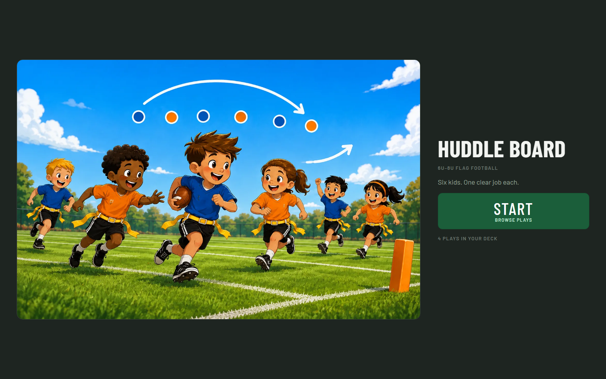
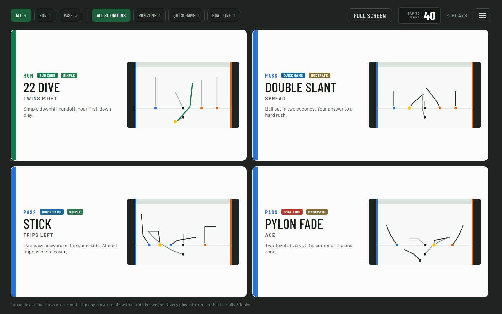
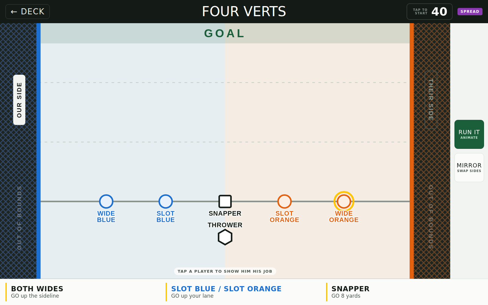

# Huddle Board

[](LICENSE)

A sideline play tool for 8U flag football — 6-on-6, no blocking, rusher seven
yards back, run and no-run zones.

The coach picks a play on a tablet, turns the screen around, and the kids watch
it animate. Every job is one of nine shapes, sides are BLUE and ORANGE instead
of left and right, and the play tells each kid where he lines up and what he
does. Works offline.

<p align="center">
  
  
  
</p>

## Run it

Nothing to install for the coaches — `dist/HuddleBoard.html` is the entire app
in one file. Copy it to a tablet and open it.

For a team, host `dist/deploy/` (free Azure App Service works) so tablets get
updates and can install to the home screen. `dist/deploy/README.md` has the
per-host setup; the short version is serve `.webmanifest` with the right MIME
type and don't cache `index.html` or `sw.js`.

Pushes to `master` build and deploy themselves — see
`.github/workflows/deploy.yml`.

## Work on it

Needs the [.NET 10 SDK](https://dotnet.microsoft.com/download). Open
`HuddleBoard.slnx` in Visual Studio, or use the command line:

```
dotnet run --project src/HuddleBoard.Build -- build   # -> dist/
dotnet run --project src/HuddleBoard.Build -- check   # fast play-library check
dotnet test                                           # the full suite, real browser
```

In Visual Studio, press F5 with **HuddleBoard.Web** as the startup project to
serve the app on localhost — that is the way to exercise the install prompt,
offline caching and browser storage, none of which work from a local file.
**HuddleBoard.Build** has a launch profile per verb.

`... -- print` regenerates the paper fallbacks — playbook, field cards, rotation
sheet — as PDFs. The first test or print run downloads Chromium for Playwright.

## What's in here

| | |
|---|---|
| `huddle_src.html` | the whole app: markup, styles, script — one file, no framework |
| `src/HuddleBoard.Playbook` | the 26 plays, the checker, the build, the print documents |
| `src/HuddleBoard.Build` | the command line |
| `src/HuddleBoard.Web` | an ASP.NET Core host for F5 and for Azure |
| `tests/HuddleBoard.Tests` | verification — real browser, five tablet shapes |
| `art/intro-art.png` | the intro illustration; swap the file and rebuild |
| `LICENSE` | MIT |

**`CLAUDE.md` is the file to read before changing anything.** It has the design
rules that are load-bearing, the coordinate system, how to add a play, and the
list of mistakes already made so they don't get made again.

## The idea

Most youth playbooks are built for the coach. This one is built for the moment
a coach has forty seconds, six children, and one of them has never played
before. So: no left and right, no letters on the field, one default rule that
covers any kid who forgets his job, and a deck small enough to find a play
without looking.

## License

[MIT](LICENSE). Copy it, fork it, put your own plays in it, put your team's name
on it, ship it to your league, sell it with your changes. No attribution beyond
keeping the licence text with the copy, no share-alike, no field-of-use
restriction, nothing to ask permission for.

The whole project is covered — the app, the play library, the checker, the build
and the print documents. `art/intro-art.png` ships under the same terms.

If it turns out to be useful to somebody else's eight-year-olds, that is the
entire point.
